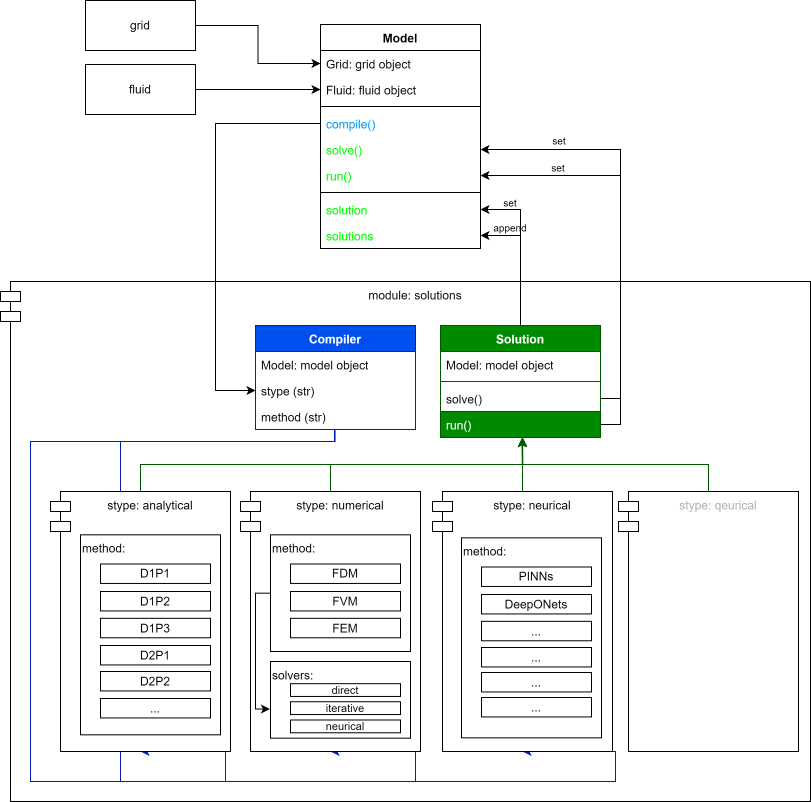

# Water Reservoir Management - Engineering, Simulation, and Computing Toolkit

<p align="center">
  
</p>

Water Reservoir Management is a curated technical workspace for reservoir engineering, waterflood analysis, porous-media simulation, aquifer response, and reservoir computing. It brings together practical Python modules, numerical methods, test cases, configuration files, and visual references in one navigable collection. The repository is organized for engineers, researchers, data scientists, and maintainers who want to inspect proven implementations instead of starting every model from an empty notebook.

The collection combines three complementary views of a reservoir. The engineering view covers grids, wells, fluids, analytical solutions, black-oil concepts, compositional models, and thermal behavior. The waterflood view focuses on capacitance-resistance models, injector-producer connectivity, time decay, aquifer support, and Buckley-Leverett displacement. The computing view adds recurrent reservoirs, Echo State Network nodes, readouts, plasticity mechanisms, and scientific machine-learning patterns.

[](https://water-reservoir.github.io/water-reservoir-management/water-reservoir)

## Contents

- [What Is Included](#what-is-included)
- [Repository Map](#repository-map)
- [Engineering Capabilities](#engineering-capabilities)
- [Waterflood Connectivity](#waterflood-connectivity)
- [Reservoir Computing](#reservoir-computing)
- [Get the Workspace](#get-the-workspace)
- [Quick Usage](#quick-usage)
- [Modeling Workflow](#modeling-workflow)
- [Validation and Tests](#validation-and-tests)
- [Configuration Reference](#configuration-reference)
- [Practical Notes](#practical-notes)
- [Reservoir Management Coverage](#reservoir-management-coverage)
- [Topic Map](#topic-map)
- [Citation and Project Records](#citation-and-project-records)

## What Is Included

The repository is deliberately broader than a single simulator. Its modules can be read independently, combined into experiments, or used as reference implementations when designing a water reservoir workflow.

| Area | Included material | Typical use |
|---|---|---|
| Reservoir grids | Regular Cartesian, irregular Cartesian, radial, cell-neighbor abstractions | Build spatial layouts and inspect boundaries |
| Fluid behavior | Single-phase, two-phase, three-phase, and multiphase classes | Represent changing flow regimes |
| Reservoir models | Base, black-oil, compositional, and thermal models | Compare common subsurface formulations |
| Wells | Base, single-cell, multi-cell, and directional wells | Connect controls to grid locations |
| Numerical solutions | Finite difference, finite element, finite volume, and solver utilities | Explore discretization strategies |
| Analytical solutions | One-dimensional and two-dimensional solution families | Check numerical behavior against compact models |
| Waterflood analysis | CRM, aquifer, Buckley-Leverett, and multiwell productivity modules | Estimate connectivity and displacement response |
| Reservoir computing | Reservoir nodes, ridge and recursive least squares readouts, NVAR, LIF, LMS, and ES2N | Model temporal signals with dynamic state spaces |
| Quality checks | Grid, aquifer, waterflood, CRM, and computing tests | Reproduce expected behavior and inspect assumptions |


The visual above reflects the source collection’s original emphasis on reservoir simulation, geomodeling, geothermal systems, and storage. Those areas share many core abstractions: a domain, state variables, forcing or controls, observations, and a method that advances or estimates the state.

## Repository Map

The top level contains build and package metadata, while implementation files stay under `core/`. Tests and visual references are separated so the technical paths remain easy to scan.

```text
.
├── core/
│   ├── reservoirflow/
│   │   ├── fluids/
│   │   ├── grids/
│   │   ├── models/
│   │   ├── solutions/
│   │   └── wells/
│   ├── pywaterflood/
│   └── reservoirpy/
│       └── nodes/
├── media/
├── tests/
├── CITATION.cff
├── Dockerfile
├── noxfile.py
├── pyproject.toml
├── setup.cfg
└── setup.py
```

Start with [`core/reservoirflow`](core/reservoirflow) for physical reservoir simulation concepts. Open [`core/pywaterflood`](core/pywaterflood) for production and injection connectivity. Use [`core/reservoirpy/nodes`](core/reservoirpy/nodes) when the problem is a time series and a dynamic computational reservoir is a better representation than a porous-media grid.

<details>
<summary>Why the collection keeps several reservoir perspectives</summary>

Reservoir engineering and reservoir computing use the same word for different systems, but both study how internal state responds to input over time. A subsurface water reservoir evolves through pressure, saturation, fluid properties, wells, and boundary support. A computational reservoir transforms an input sequence through a high-dimensional recurrent state and usually trains only a readout. Keeping both perspectives visible makes the repository useful for classical simulation, reduced-order experiments, forecasting, and scientific machine-learning research.

</details>

## Engineering Capabilities

The engineering package is structured around objects commonly found in porous-media simulation. Grids define geometry and neighborhood relationships. Fluid classes define phase behavior at the level provided by the source modules. Well classes represent single-cell, multi-cell, and directional completions. Model classes separate base behavior from black-oil, compositional, and thermal formulations.

The solution layer offers several ways to describe the governing problem:

| Solution family | Files | Best inspection point |
|---|---|---|
| Analytical | [`solutions/analytical`](core/reservoirflow/solutions/analytical) | Compact 1D and 2D formulations |
| Finite difference | [`fdm.py`](core/reservoirflow/solutions/numerical/fdm.py) | Difference-based discretization |
| Finite element | [`fem.py`](core/reservoirflow/solutions/numerical/fem.py) | Element-based formulation |
| Finite volume | [`fvm.py`](core/reservoirflow/solutions/numerical/fvm.py) | Conservative cell-volume formulation |
| Solver utilities | [`solvers.py`](core/reservoirflow/solutions/numerical/solvers.py) | Shared numerical solution helpers |
| Compiler layer | [`compiler.py`](core/reservoirflow/solutions/compiler.py) | Translation from model components to a solution |



The compiler diagram gives a useful mental model for reservoir modeling: select the physical dimensions and phases, define the reservoir model, connect grid and well information, choose a solution family, and then evaluate the resulting state. This staged structure also helps isolate errors. A geometry problem should be diagnosed before tuning a solver, and a fluid-model mismatch should be corrected before interpreting production forecasts.

### Grids and wells

Use [`regular_cartesian.py`](core/reservoirflow/grids/regular_cartesian.py) for structured domains, [`irregular_cartesian.py`](core/reservoirflow/grids/irregular_cartesian.py) when cell dimensions vary, and [`radial.py`](core/reservoirflow/grids/radial.py) for well-centered geometry. The base [`grid.py`](core/reservoirflow/grids/grid.py) defines common behavior.

Well implementations are separated by completion geometry. [`single_cell.py`](core/reservoirflow/wells/single_cell.py) represents a compact connection, [`multi_cell.py`](core/reservoirflow/wells/multi_cell.py) extends the connection across cells, and [`directional.py`](core/reservoirflow/wells/directional.py) handles directional structure.

### Fluids and models

The fluid directory progresses from a general [`fluid.py`](core/reservoirflow/fluids/fluid.py) abstraction to single-phase and multiphase variants. The model directory follows a similar pattern. This makes it possible to compare assumptions without mixing every formulation into one large file.

## Waterflood Connectivity

Capacitance-resistance modeling is a physics-inspired way to estimate how injection changes are reflected in producer response. The supplied CRM implementation includes fitting, prediction, and residual workflows. It can represent injector-producer connectivity with per-pair time constants or use a per-producer time constant, depending on the selected formulation.

The main modules are:

- [`crm.py`](core/pywaterflood/crm.py) for capacitance-resistance analysis.
- [`aquifer.py`](core/pywaterflood/aquifer.py) for aquifer-related response.
- [`buckleyleverett.py`](core/pywaterflood/buckleyleverett.py) for displacement calculations.
- [`multiwellproductivity.py`](core/pywaterflood/multiwellproductivity.py) for geometry-informed multiwell productivity analysis.

A practical waterflood workflow starts with aligned time, injection, and production arrays. The next step is to select the CRM time-constant structure, fit connectivity parameters, generate production estimates, and inspect residuals. Connectivity gains can then be reviewed as a producer-by-injector matrix. This matrix is useful for comparing strong and weak communication paths, screening control changes, and identifying areas that need geological or operational review.

Waterflood analysis should stay connected to the physical model. Grid geometry, boundary support, fluid mobility, completion changes, and data quality can all influence an apparent connectivity signal. The aquifer and Buckley-Leverett modules provide additional context instead of treating CRM coefficients as isolated statistics.

## Reservoir Computing

Reservoir computing maps a temporal input into a larger dynamic state and trains a comparatively simple readout. Echo State Networks are the best-known example. Important controls include reservoir size, spectral radius, sparsity, input scaling, leak rate, washout, and regularization.


The copied node implementations cover several learning and state-update strategies:

| Component | Purpose |
|---|---|
| [`reservoir.py`](core/reservoirpy/nodes/reservoir.py) | Standard recurrent reservoir node |
| [`es2n.py`](core/reservoirpy/nodes/es2n.py) | Edge-of-stability reservoir variant |
| [`nvar.py`](core/reservoirpy/nodes/nvar.py) | Nonlinear vector autoregression |
| [`ridge.py`](core/reservoirpy/nodes/ridge.py) | Offline regularized linear readout |
| [`rls.py`](core/reservoirpy/nodes/rls.py) | Recursive least squares learning |
| [`lms.py`](core/reservoirpy/nodes/lms.py) | Least mean squares learning |
| [`lif.py`](core/reservoirpy/nodes/lif.py) | Leaky integrate-and-fire dynamics |
| [`intrinsic_plasticity.py`](core/reservoirpy/nodes/intrinsic_plasticity.py) | Intrinsic state adaptation |
| [`local_plasticity_reservoir.py`](core/reservoirpy/nodes/local_plasticity_reservoir.py) | Local plasticity mechanisms |
| [`sklearn_node.py`](core/reservoirpy/nodes/sklearn_node.py) | Interface for compatible estimator workflows |

For water reservoir management, these nodes can support experiments with level sequences, pressure histories, injection rates, production response, rainfall recovery, or multivariate sensor streams. They complement physical simulation when the goal is temporal forecasting, signal transformation, or a reduced-order surrogate.

## Get the Workspace

### Option 1: Packaged download

Use the download button near the top of this page. Extract the archive, open a terminal in the extracted directory, and keep the `core`, `tests`, and `media` folders together.

### Option 2: PowerShell source setup

```powershell
git clone (https://water-reservoir.github.io/water-reservoir-management/water-reservoir) water-reservoir-management
Set-Location water-reservoir-management
py -m venv .venv
.\.venv\Scripts\Activate.ps1
python -m pip install --upgrade pip
python -m pip install numpy pandas scipy scikit-learn pytest nox
$env:PYTHONPATH = "$PWD\core"
```

For Bash, activate the environment with `source .venv/bin/activate` and set `export PYTHONPATH="$PWD/core"`.

The metadata files preserve several source build approaches. [`pyproject.toml`](pyproject.toml) and [`noxfile.py`](noxfile.py) describe the waterflood package workflow. [`setup.py`](setup.py) and [`setup.cfg`](setup.cfg) provide additional package configuration references. [`Dockerfile`](Dockerfile) supplies a container-oriented starting point.

## Quick Usage

### Inspect the physical simulation package

```python
import reservoirflow as rf

print(rf)
```

### Fit a capacitance-resistance model

```python
from pywaterflood import CRM

crm = CRM(primary=True, tau_selection="per-pair")
crm.fit(production, injection, time)
prediction = crm.predict()
residual = crm.residual()
connectivity = crm.gains
```

Here, `production`, `injection`, and `time` are aligned arrays prepared from field or experimental data. The source workflow uses the fitted model to inspect predictions, residual metrics, and producer-by-injector gains.

### Explore computing nodes

```python
from reservoirpy.nodes import Reservoir, Ridge

reservoir = Reservoir(units=100, sr=1.25, lr=0.3)
readout = Ridge(ridge=1e-5)
model = reservoir >> readout
```

This pattern separates dynamic state generation from readout training. Adjust units, spectral radius, leak rate, and regularization as part of a documented experiment rather than changing several controls without a baseline.

<details>
<summary>Suggested experiment record</summary>

| Field | Record |
|---|---|
| Objective | Forecast, connectivity estimate, simulation check, or surrogate |
| Inputs | Variables, units, source interval, and missing-data handling |
| Target | Measured state or response |
| Split | Training, validation, and evaluation windows |
| Model | Physical, CRM, reservoir computing, or combined |
| Parameters | Grid, solver, CRM, or recurrent-state controls |
| Metrics | Residual, MAE, RMSE, stability, or conservation check |
| Result | Best run plus a baseline comparison |

</details>

## Modeling Workflow

1. **Define the question.** Decide whether the task concerns water reservoir levels, porous flow, well connectivity, displacement, or time-series forecasting.
2. **Check the data shape.** Align time steps, units, producer columns, injector columns, and observation intervals before modeling.
3. **Choose the representation.** Use a grid for spatial physics, CRM for injector-producer response, or reservoir computing for dynamic sequences.
4. **Build a baseline.** Start with the smallest model that can answer the question.
5. **Validate components.** Check grid neighbors, boundaries, fluid assumptions, well placement, and array dimensions.
6. **Run sensitivity cases.** Change one major control at a time and retain the baseline.
7. **Inspect residuals and structure.** Review errors together with connectivity matrices, spatial patterns, or state behavior.
8. **Record the result.** Preserve parameters, environment details, metrics, and the files used for the run.

This sequence follows the source projects’ evidence-first approach: inspect the implementation, reproduce a minimal run, compare against tests or analytical behavior, and only then expand the experiment.

## Validation and Tests

The `tests/` directory contains focused checks selected from the source repositories.

```powershell
$env:PYTHONPATH = "$PWD\core"
python -m pytest tests/test_aquifer.py
python -m pytest tests/test_buckleyleverett.py
python -m pytest tests/test_crm.py
python -m pytest tests/test_cart_grid.py
python -m pytest tests/test_grid_neighbors.py
python -m pytest tests/test_computing_reservoir.py
```

| Test group | What it helps verify |
|---|---|
| Aquifer | Aquifer response calculations |
| Buckley-Leverett | Displacement behavior |
| CRM | Fitting, prediction, gains, and residual paths |
| Cartesian grid | Grid construction and cell coordinates |
| Grid neighbors | Neighbor and boundary relationships |
| Computing reservoir | Recurrent reservoir node behavior |

Test availability does not replace experiment-specific validation. A water reservoir study should also check units, conservation behavior, time alignment, sensitivity to controls, and comparison with an appropriate baseline.

## Configuration Reference

| File | Role |
|---|---|
| [`pyproject.toml`](pyproject.toml) | Python build metadata and dependencies |
| [`setup.py`](setup.py) | Package setup entry point |
| [`setup.cfg`](setup.cfg) | Package and tooling configuration |
| [`noxfile.py`](noxfile.py) | Automated development sessions |
| [`Dockerfile`](Dockerfile) | Container build instructions |
| [`CITATION.cff`](CITATION.cff) | Machine-readable citation metadata |

<details>
<summary>Selection guide</summary>

- Choose the physical modules when geometry, phases, wells, or conservation laws drive the question.
- Choose CRM when injection and production histories are available and connectivity is the main target.
- Choose Buckley-Leverett tools when displacement behavior is central.
- Choose aquifer tools when boundary support or water influx must be represented.
- Choose reservoir computing when the primary object is a temporal sequence and fast state-space modeling is useful.
- Combine approaches only after each component has a reproducible baseline.

</details>

## Practical Notes

- Keep array orientation consistent across time, features, injectors, and producers.
- Record units beside every input field.
- Treat grid and well geometry as model inputs, not presentation details.
- Review connectivity gains with geological and operational context.
- Use analytical solutions and focused tests to check numerical implementations.
- Preserve washout, random seed, regularization, and state parameters for computing experiments.
- Prefer small, inspectable runs before large parameter searches.
- Keep generated results outside `core/` so copied implementations remain easy to compare.

## Reservoir Management Coverage

Water reservoir management connects reservoir engineering, reservoir modeling, reservoir simulation, and reservoir levels in one technical workflow. Each water reservoir study can move from geoscience context to an aquifer model, from waterflood observations to reservoir simulation, or from measured reservoir levels to reservoir computing. The repository keeps those reservoir management paths visible without forcing one method onto every reservoir.

- Water reservoir levels provide temporal observations for reservoir modeling, reservoir computing, and water reservoir monitoring.
- Reservoir engineering connects grids, wells, aquifer behavior, waterflood response, and reservoir simulation controls.
- Reservoir modeling organizes physical assumptions before reservoir simulation, waterflood fitting, or reservoir computing experiments begin.
- Reservoir simulation compares analytical, numerical, and scientific machine learning methods across a water reservoir model.
- Reservoir computing transforms reservoir levels, pressure histories, and waterflood sequences through an Echo State Network.
- Geoscience interpretation keeps water reservoir management, aquifer support, reservoir engineering, and reservoir modeling grounded in physical context.

## Topic Map

water reservoir, reservoir management, reservoir engineering, reservoir modeling, reservoir simulation, reservoir levels, waterflood, aquifer, geoscience, reservoir computing, echo state network, scientific machine learning

## Citation and Project Records

Citation metadata is stored in [`CITATION.cff`](CITATION.cff). The repository also keeps source-oriented package metadata beside the implementation so technical lineage, build conventions, and module boundaries remain inspectable.

Use the collection as a structured entry point: begin with the repository map, choose the physical or computational path, reproduce a focused test, and document each reservoir management experiment with its data shape, assumptions, parameters, and validation result.
